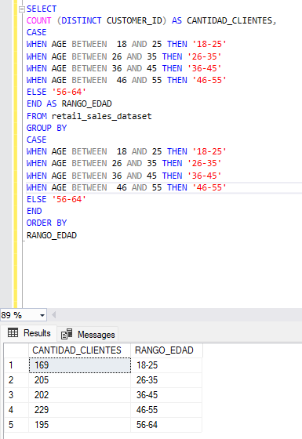
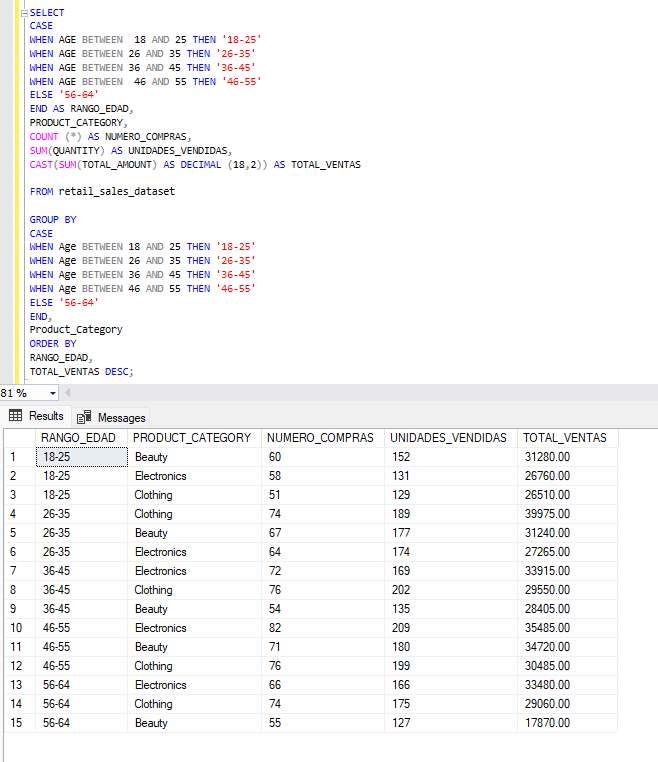
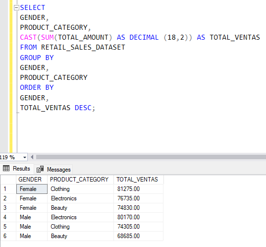
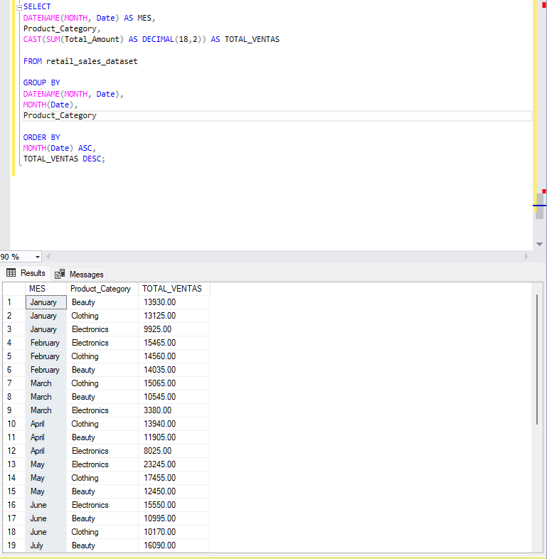
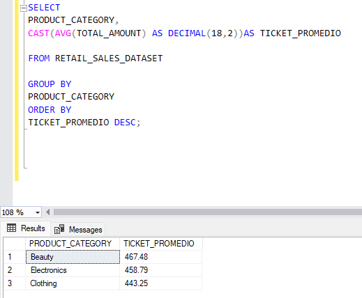
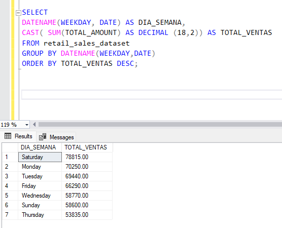
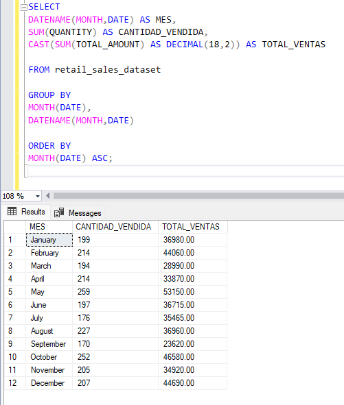
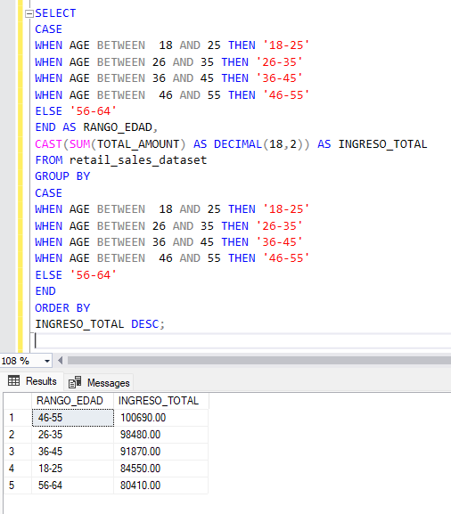
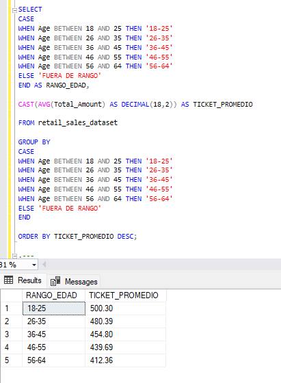
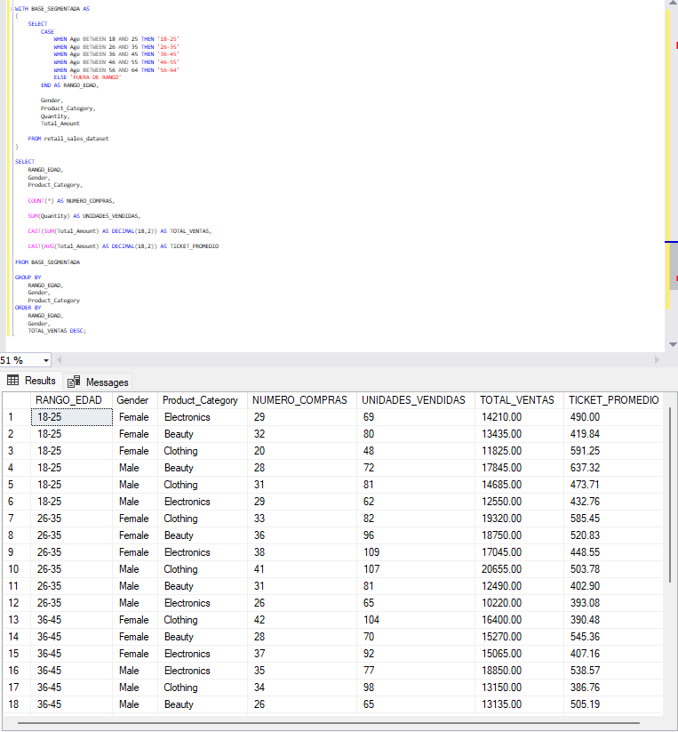

# Análisis de Ventas Retail mediante SQL

## Contexto del proyecto

El presente proyecto analiza el comportamiento de las ventas de una empresa del sector retail mediante consultas SQL. La base de datos contiene información relacionada con transacciones, clientes, categorías de productos, cantidades vendidas, precios y montos totales.

El objetivo es identificar patrones de compra, analizar el desempeño comercial y obtener información útil para apoyar decisiones de marketing y ventas.

## Descripción de las columnas

| Columna | Descripción |
|---|---|
| Transaction_ID | Identificador único de cada transacción |
| Date | Fecha en la que se realizó la compra |
| Customer_ID | Identificador del cliente |
| Gender | Género del cliente |
| Age | Edad del cliente |
| Product_Category | Categoría del producto |
| Quantity | Cantidad de unidades adquiridas |
| Price_per_Unit | Precio por unidad |
| Total_Amount | Monto total de la transacción |

## Preguntas de análisis


### 1. ¿Cuántos clientes hay por rango de edad?

#### Query

```sql
SELECT
    COUNT(DISTINCT Customer_ID) AS CANTIDAD_CLIENTES,
    CASE
        WHEN Age BETWEEN 18 AND 25 THEN '18-25'
        WHEN Age BETWEEN 26 AND 35 THEN '26-35'
        WHEN Age BETWEEN 36 AND 45 THEN '36-45'
        WHEN Age BETWEEN 46 AND 55 THEN '46-55'
        ELSE '56-64'
    END AS RANGO_EDAD
FROM retail_sales_dataset
GROUP BY
    CASE
        WHEN Age BETWEEN 18 AND 25 THEN '18-25'
        WHEN Age BETWEEN 26 AND 35 THEN '26-35'
        WHEN Age BETWEEN 36 AND 45 THEN '36-45'
        WHEN Age BETWEEN 46 AND 55 THEN '46-55'
        ELSE '56-64'
    END
ORDER BY
    RANGO_EDAD;
```



#### Interpretación

El rango de 46 a 55 años concentra la mayor cantidad de clientes, con 229 registros. Le siguen los grupos de 26 a 35 años con 205 clientes y de 36 a 45 años con 202. Esto permite identificar qué segmentos etarios tienen mayor presencia dentro de la base de clientes.


## 2. ¿Qué categoría genera mayores ventas en cada rango de edad?

#### Query

```sql
SELECT
    CASE
        WHEN Age BETWEEN 18 AND 25 THEN '18-25'
        WHEN Age BETWEEN 26 AND 35 THEN '26-35'
        WHEN Age BETWEEN 36 AND 45 THEN '36-45'
        WHEN Age BETWEEN 46 AND 55 THEN '46-55'
        ELSE '56-64'
    END AS RANGO_EDAD,

    Product_Category,
    COUNT(*) AS NUMERO_COMPRAS,
    SUM(Quantity) AS UNIDADES_VENDIDAS,
    CAST(SUM(Total_Amount) AS DECIMAL(18,2)) AS TOTAL_VENTAS

FROM retail_sales_dataset

GROUP BY
    CASE
        WHEN Age BETWEEN 18 AND 25 THEN '18-25'
        WHEN Age BETWEEN 26 AND 35 THEN '26-35'
        WHEN Age BETWEEN 36 AND 45 THEN '36-45'
        WHEN Age BETWEEN 46 AND 55 THEN '46-55'
        ELSE '56-64'
    END,
    Product_Category

ORDER BY
    RANGO_EDAD,
    TOTAL_VENTAS DESC;
```

#### Resultado



#### Interpretación

La categoría con mayores ventas varía según el rango de edad. En el segmento de 18 a 25 años, Beauty lidera con 31,280.00. Entre los clientes de 26 a 35 años, Clothing registra el mayor nivel de ventas con 39,975.00. Por otro lado, Electronics presenta las mayores ventas en los rangos de 36 a 45, 46 a 55 y 56 a 64 años. Estos resultados permiten identificar diferencias en el comportamiento de compra según la edad y pueden apoyar la orientación de estrategias comerciales y promocionales hacia cada segmento.

## 3. ¿Qué categoría genera mayores ventas según el género del cliente?

#### Query

```sql
SELECT
    Gender,
    Product_Category,
    CAST(SUM(Total_Amount) AS DECIMAL(18,2)) AS TOTAL_VENTAS

FROM retail_sales_dataset

GROUP BY
    Gender,
    Product_Category

ORDER BY
    Gender,
    TOTAL_VENTAS DESC;
```

#### Resultado



#### Interpretación

Las categorías con mayores ventas presentan diferencias según el género del cliente. Entre las mujeres, Clothing registra el mayor monto de ventas con 81,275.00, seguida de Electronics con 76,735.00 y Beauty con 74,830.00. En el caso de los hombres, Electronics lidera con 80,170.00, seguida de Clothing con 74,305.00 y Beauty con 68,685.00.

Estos resultados muestran que Clothing tiene una mayor participación entre las mujeres, mientras que Electronics destaca entre los hombres. Esta información puede ser útil para orientar campañas, promociones y mensajes comerciales considerando las categorías con mejor desempeño en cada segmento.


## 4. ¿Qué categoría genera mayores ventas en cada mes?

#### Query

```sql
SELECT
    DATENAME(MONTH, Date) AS MES,
    Product_Category,
    CAST(SUM(Total_Amount) AS DECIMAL(18,2)) AS TOTAL_VENTAS

FROM retail_sales_dataset

GROUP BY
    DATENAME(MONTH, Date),
    MONTH(Date),
    Product_Category

ORDER BY
    MONTH(Date) ASC,
    TOTAL_VENTAS DESC;
```

#### Resultado



#### Interpretación

Las categorías con mayores ventas varían a lo largo de los meses. Por ejemplo, en enero la categoría Beauty registra el mayor nivel de ventas con 13,930.00, mientras que en febrero lidera Electronics con 15,465.00. En marzo y abril destaca Clothing, mientras que en mayo y junio Electronics vuelve a ocupar la primera posición. Estos resultados muestran que el desempeño de las categorías cambia según el periodo, información que puede ser útil para planificar promociones y acciones comerciales de acuerdo con la demanda mensual.


## 5. ¿Qué categoría de producto presenta el mayor ticket promedio?

#### Query

```sql
SELECT
    Product_Category,
    CAST(AVG(Total_Amount) AS DECIMAL(18,2)) AS TICKET_PROMEDIO
FROM retail_sales_dataset
GROUP BY
    Product_Category
ORDER BY
    TICKET_PROMEDIO DESC;
```

#### Resultado



#### Interpretación

La categoría Beauty presenta el mayor ticket promedio, con 467.48 por transacción. Le sigue Electronics con 458.79 y, finalmente, Clothing con 443.25. Esto indica que, aunque una categoría no necesariamente concentre el mayor volumen total de ventas, puede registrar un mayor gasto promedio por compra. Este indicador puede ser útil para identificar categorías con mayor valor promedio por transacción y orientar acciones comerciales o promocionales.


## 6. ¿Qué día de la semana genera mayores ventas?

#### Query

```sql
SELECT
    DATENAME(WEEKDAY, Date) AS DIA_SEMANA,
    CAST(SUM(Total_Amount) AS DECIMAL(18,2)) AS TOTAL_VENTAS
FROM retail_sales_dataset
GROUP BY
    DATENAME(WEEKDAY, Date)
ORDER BY
    TOTAL_VENTAS DESC;
```

#### Resultado



#### Interpretación

El sábado registra el mayor nivel de ventas, con un total de 78,815.00. Le siguen el lunes con 70,250.00 y el martes con 69,440.00. En contraste, el jueves presenta el menor nivel de ventas, con 53,835.00.

Este resultado permite identificar los días con mayor y menor desempeño comercial. A nivel de marketing, la empresa podría aprovechar los días de mayor demanda para reforzar campañas o promociones de alto impacto, mientras que los días con menor venta podrían ser utilizados para aplicar descuentos o acciones promocionales orientadas a estimular la demanda.


## 7. ¿Qué mes registra mayores ventas y mayor cantidad de unidades vendidas?

#### Query

```sql
SELECT
    DATENAME(MONTH, Date) AS MES,
    SUM(Quantity) AS CANTIDAD_VENDIDA,
    CAST(SUM(Total_Amount) AS DECIMAL(18,2)) AS TOTAL_VENTAS

FROM retail_sales_dataset

GROUP BY
    MONTH(Date),
    DATENAME(MONTH, Date)

ORDER BY
    MONTH(Date) ASC;
```

#### Resultado



#### Interpretación

El mes de mayo presenta el mejor desempeño comercial del periodo analizado, con 259 unidades vendidas y un total de ventas de 53,150.00. Le sigue octubre, con 252 unidades vendidas y 46,580.00 en ventas.

Por el contrario, septiembre registra el menor desempeño, con 170 unidades vendidas y 23,620.00 en ventas. Los resultados muestran variaciones importantes entre los meses, lo que permite identificar periodos de mayor y menor demanda.

Esta información puede ser útil para la planificación comercial y de marketing, ya que permite reconocer los meses con mayor actividad para reforzar campañas, disponibilidad de productos o acciones de comunicación, así como identificar los periodos de menor desempeño en los que podrían implementarse promociones para estimular la demanda.


## 8. ¿Qué rango de edad genera mayores ingresos?

#### Query

```sql
SELECT
    CASE
        WHEN Age BETWEEN 18 AND 25 THEN '18-25'
        WHEN Age BETWEEN 26 AND 35 THEN '26-35'
        WHEN Age BETWEEN 36 AND 45 THEN '36-45'
        WHEN Age BETWEEN 46 AND 55 THEN '46-55'
        ELSE '56-64'
    END AS RANGO_EDAD,

    CAST(SUM(Total_Amount) AS DECIMAL(18,2)) AS INGRESO_TOTAL

FROM retail_sales_dataset

GROUP BY
    CASE
        WHEN Age BETWEEN 18 AND 25 THEN '18-25'
        WHEN Age BETWEEN 26 AND 35 THEN '26-35'
        WHEN Age BETWEEN 36 AND 45 THEN '36-45'
        WHEN Age BETWEEN 46 AND 55 THEN '46-55'
        ELSE '56-64'
    END

ORDER BY
    INGRESO_TOTAL DESC;
```

#### Resultado



#### Interpretación

El rango de edad de 46 a 55 años genera los mayores ingresos, con un total de 100,690.00. Le sigue el grupo de 26 a 35 años, con 98,480.00. Por otro lado, el rango de 56 a 64 años presenta el menor nivel de ingresos, con 80,410.00. Esto permite identificar qué grupos de edad aportan mayores ventas al negocio.


## 9. ¿Qué rango de edad presenta el mayor ticket promedio?

#### Query

```sql
SELECT
    CASE
        WHEN Age BETWEEN 18 AND 25 THEN '18-25'
        WHEN Age BETWEEN 26 AND 35 THEN '26-35'
        WHEN Age BETWEEN 36 AND 45 THEN '36-45'
        WHEN Age BETWEEN 46 AND 55 THEN '46-55'
        WHEN Age BETWEEN 56 AND 64 THEN '56-64'
        ELSE 'FUERA DE RANGO'
    END AS RANGO_EDAD,

    CAST(AVG(Total_Amount) AS DECIMAL(18,2)) AS TICKET_PROMEDIO

FROM retail_sales_dataset

GROUP BY
    CASE
        WHEN Age BETWEEN 18 AND 25 THEN '18-25'
        WHEN Age BETWEEN 26 AND 35 THEN '26-35'
        WHEN Age BETWEEN 36 AND 45 THEN '36-45'
        WHEN Age BETWEEN 46 AND 55 THEN '46-55'
        WHEN Age BETWEEN 56 AND 64 THEN '56-64'
        ELSE 'FUERA DE RANGO'
    END

ORDER BY
    TICKET_PROMEDIO DESC;
```

#### Resultado



#### Interpretación

El rango de edad de 18 a 25 años presenta el mayor ticket promedio, con 500.30 por transacción. Le siguen los clientes de 26 a 35 años, con un promedio de 480.39. Por otro lado, el grupo de 56 a 64 años registra el menor ticket promedio, con 412.36. Esto permite identificar qué segmentos de edad realizan, en promedio, compras de mayor valor.


## 10. ¿Cómo varía el comportamiento de compra según el rango de edad, género y categoría de producto?

#### Query

```sql
WITH BASE_SEGMENTADA AS
(
    SELECT
        CASE
            WHEN Age BETWEEN 18 AND 25 THEN '18-25'
            WHEN Age BETWEEN 26 AND 35 THEN '26-35'
            WHEN Age BETWEEN 36 AND 45 THEN '36-45'
            WHEN Age BETWEEN 46 AND 55 THEN '46-55'
            WHEN Age BETWEEN 56 AND 64 THEN '56-64'
            ELSE 'FUERA DE RANGO'
        END AS RANGO_EDAD,

        Gender,
        Product_Category,
        Quantity,
        Total_Amount

    FROM retail_sales_dataset
)

SELECT
    RANGO_EDAD,
    Gender,
    Product_Category,
    COUNT(*) AS NUMERO_COMPRAS,
    SUM(Quantity) AS UNIDADES_VENDIDAS,
    CAST(SUM(Total_Amount) AS DECIMAL(18,2)) AS TOTAL_VENTAS,
    CAST(AVG(Total_Amount) AS DECIMAL(18,2)) AS TICKET_PROMEDIO

FROM BASE_SEGMENTADA

GROUP BY
    RANGO_EDAD,
    Gender,
    Product_Category

ORDER BY
    RANGO_EDAD,
    Gender,
    TOTAL_VENTAS DESC;
```

#### Resultado



#### Interpretación

Esta consulta permite analizar conjuntamente el rango de edad, género y categoría de producto, considerando además el número de compras, las unidades vendidas, las ventas totales y el ticket promedio. De esta manera, es posible identificar diferencias más específicas en el comportamiento de los distintos segmentos de clientes.

Por ejemplo, dentro del rango de 18 a 25 años se observan diferencias en el desempeño de las categorías según el género. Este nivel de segmentación puede ser útil para orientar promociones, mensajes y acciones comerciales hacia grupos de clientes con características y comportamientos de compra específicos.


## Conclusión

El análisis permitió identificar diferencias importantes en el comportamiento de compra de los clientes. El segmento de 46 a 55 años presenta la mayor cantidad de clientes y también genera el mayor nivel de ingresos, mientras que el grupo de 18 a 25 años registra el ticket promedio más alto. Esto demuestra que el segmento con mayor participación no necesariamente coincide con el que realiza compras de mayor valor promedio.

También se identificaron patrones relevantes según categoría y periodo. Beauty presenta el mayor ticket promedio por categoría, mientras que las categorías con mayores ventas varían según el género, el rango de edad y el mes. A nivel temporal, el sábado registra el mayor nivel de ventas y mayo presenta el mejor desempeño mensual tanto en unidades vendidas como en ventas totales.

En conjunto, estos resultados permiten comprender mejor el comportamiento de los distintos segmentos de clientes y pueden servir como apoyo para la planificación de promociones, campañas y acciones comerciales más específicas. El uso de SQL permitió organizar, agrupar y cruzar diferentes variables de la base de datos para transformar los registros de ventas en información útil para la toma de decisiones.